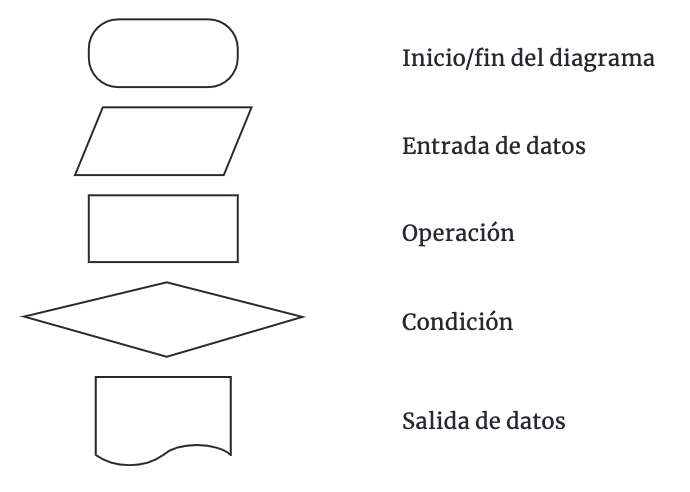

## clase 1

La actividad fundamental del programador es resolver problemas empleando el ordenador como herramienta fundamental

un grupo de instrucciones (Algoritmo)

Un algoritmo son los pasos secuenciales, son los que deben ser ejecutados uno después de otro, y los pasos ordenados son los que deben llevar un orden obligatorio. Como puede notarse, lo que permite un algoritmo es lograr un objetivo.

### diagrama de flujo

Los diagramas de flujo son la representación gráfica de un ALGORITMO. Se les llama diagramas de flujo, porque los símbolos utilizados se conectan por medio de flechas para indicar la secuencia de operación.

<kbd></kbd>

Las ventajas de usar diagramas de flujo son: 

- Favorecen la comprensión del proceso a través de mostrarlo como un dibujo. Un buen diagrama de flujo reemplaza varias páginas de texto. 
- Permiten distinguir los problemas y las oportunidades de mejora del proceso. 
- Se identifican los pasos redundantes, los conflictos, las responsabilidades y los puntos de decisión.

todo problema está constituido por: 

- Datos conocidos: Datos con los que se cuenta al comenzar el problema. 
- Proceso: Operaciones a realizar con los datos conocidos. 
- Información resultante: Es la información que se obtiene del proceso y nos permite resolver el problema.

Una variable es un depósito donde hay un valor. Consta de un nombre y pertenece a un tipo de dato. Usar nombres representativos de las variables. Los nombres de variable no pueden tener espacios en blanco, caracteres especiales o empezar con un número.

Python es sensible a mayúsculas y minúsculas

- A los errores tipográficos, como por ejemplo indicar el nombre incorrecto de la función, nombres de variables incorrectas, falta de paréntesis, palabras claves mal escritas, etc, los llamamos errores SINTÁCTICOS. Un programa no se puede ejecutar sin corregir absolutamente todos los errores sintácticos. 
- Existe otro tipo de errores llamados ERRORES LÓGICOS. Este tipo de errores en programas grandes (miles de líneas) son más difíciles de localizar. Por ejemplo, un programa que permite hacer la facturación, pero la salida de datos por impresora es incorrecta.

Cuando en un problema solo participan operaciones, entradas y salidas se la denomina una estructura secuencial (o lineal, vs programacion estructurada - clase 8).


## clase 7

### listas

- agregar elementos al final mediante el método `append`: lista.append('holis').
- eliminar cualquiera de sus componentes llamando al método `pop` e indicando la posición del elemento a borrar: `lista.pop(0)`. cuando un elemento de la lista se elimina no queda una posición vacía, sino se desplazan todos los elementos de la derecha una posición. por eso, tenemos que usar una estructura iterable `while` (no `for`):

```
lista = [ 10,11,4,-1,120,56,0,30,9]

position = 0
while position < len(lista):
    if lista[position] > 9:
        lista.pop(position)
    else:
        position += 1
```

## clase 8

### programación estructurada

- programación lineal: problemas chicos, sin funciones
- programación estructurada: busca dividir o descomponer un problema complejo en pequeños problemas. La solución de cada uno de esos pequeños problemas nos trae la solución del problema complejo. el planteo de esas pequeñas soluciones al problema complejo se hace dividiendo el programa en funciones. la división en pequeñas funciones nos permitirá tener un programa más ordenado y fácil de entender y por lo tanto en mantener
- función o método: fracción de programa que cumple una misión específica. Generalmente el término Función es utilizado en la Programación Estructurada y el término Método, es utilizado en la Programación Orientada a Objetos (POO).
- parámetros para recibir datos. Los parámetros nos permiten comunicarle algo a la función y la hace más flexible. Podemos imaginar a un parámetro, como una variable que solo se puede utilizar dentro de la función y el valor se carga cuando se la llama. los parámetros son la forma para que una función reciba datos para ser procesados.
- return: devolver un dato a quien invocó la función. Después de la palabra return no se ejecuta nada.

## clase 9

### parámetros de tipo lista en funciones

una función puede recibir tanto datos simples como estructuras de datos. Ya hemos estudiado en clases anteriores una estructura de datos: la lista. una función también puede retornar una estructura de datos tipo lista. Con esto estamos logrando que una función retorne varios datos ya que una lista es una colección de dato.

Python también nos permite descomponer los valores devueltos por la función en varias variables que reciban cada elemento de esa lista: # bloque principal del programa lista=carga_lista() mayor, menor=retornar_mayormenor(lista) print("Mayor elemento de la lista:",mayor) print("Menor elemento de la lista:",menor). Cada elemento de la lista se guarda en el mismo orden, es decir la componente 0 de la lista se guarda en la variable mayor y la componente 1 de la lista se guarda en la variable menor.

ejemplo:

```python
lista = [1,2,3,-1,-2-,3]

def comparar(lista):
    p = []
    n = []
    for i in range(len(lista)):
        if lista[i] >= 0:
            p.append(lista[i])
        else:
            n.append(lista[i])
    return p, n

positivos, negativos = comparar(lista)
```
 
- desempeños del 70 al 75

## clase 10

### tuplas vs listas

Una tupla permite almacenar una colección de datos no necesariamente del mismo tipo. | Los datos de la tupla son inmutables a diferencia de las listas que son mutables. Esto implica que una vez inicializada la tupla no podemos agregar, borrar o modificar sus elementos. elementos. La sintaxis para definir una tupla es indicar entre paréntesis sus valores

Podemos acceder a los elementos de una tupla en forma similar a una lista por medio de un subíndice: `print(punto[0])`

Utilizamos una tupla para agrupar datos que por su naturaleza están relacionados y que no serán modificados durante la ejecución del programa

la conversión de tuplas a listas y viceversa mediante las funciones: `list(parametro de tipo tupla)` `tuple(parametro de tipo lista)`

Podemos generar una tupla asignando a una variable un conjunto de variables o valores separados por coma

```py
x=10 
y=30 
punto=x,y 
print(punto)
#(10, 30)
print(type(punto))
#<class 'tuple'>
```

el desempaquetado de la tupla "fecha" se produce cuando definimos tres variables separadas por coma y le asignamos una tupla

```py
fecha=(25, "diciembre", 2016) 
print(fecha) 
dd,mm,aa=fecha
```

### for para recorrer tuplas y listas

una segunda forma de acceder a los elementos de una lista con la estructura repetitiva for sin indicar subíndices.

```py
lista=[2, 3, 50, 7, 9] 
for elemento in lista: 
    print(elemento) 
```

Como podemos ver la instrucción for requiere una variable (en este ejemplo llamada elemento), luego la palabra clave in y por último el nombre de la lista. El bloque del for se ejecuta tantas veces como elementos tenga la lista, y en cada vuelta del for la variable elemento almacena un valor de la lista.

Algo nuevo podemos ver ahora en el for para recuperar cada tupla almacenada en la lista. Podemos ver que desempaquetamos la tupla que devuelve el for en cada vuelta en las variables nombre y sueldo. Esto nos facilita la impresión de los datos sin tener que indicar subíndices para los elementos de la tupla:

```py
def cargar(): 
    empleados=[] 
    for x in range(5): 
        nombre=input("Nombre del empleado:") 
        sueldo=int(input("Ingrese el sueldo:")) 
        empleados.append((nombre,sueldo)) 
    return empleados

def imprimir(empleados): 
    print("Listado de los nombres de empleados y sus sueldos") 
    for nombre,sueldo in empleados: 
        print(nombre,sueldo)

lista = cargar()
imprimir(lista)
```

## clase 11

### diccionarios y su diferencia con las demás estructuras

La estructura de datos tipo diccionario utiliza una clave para acceder a un valor. Este valor puede ser un entero, un float, un string, una tupla etc.

Recordemos que las listas son mutables y las tuplas inmutables. Un diccionario es una estructura de datos mutable es decir: que podemos agregar, modificar y borrar sus elementos.

Definición de un diccionario por asignación. 

`productos={"manzanas":39, "peras":32, "lechuga":17}`

Mediante el ciclo repetitivo for podemos acceder sucesivamente a las claves almacenadas en el diccionario y luego conociendo la clave podemos acceder al valor de forma similar a las listas indicando como subíndice la clave:

```py
paises={"argentina":40000000, "españa":46000000, "brasil":190000000, "uruguay": 3400000}

for clave in paises:
    print(clave,paises[clave])

#argentina 40000000
#españa 46000000
#brasil 190000000
#uruguay 3400000
```

Crear un diccionario:

```py
productos={} 
for x in range(5): 
    nombre=input("Ingrese el nombre del producto:")
    precio=int(input("Ingrese el precio:")) 
    productos[nombre]=precio
```

Si ya existe el nombre de producto en el diccionario se modifica el valor para esa clave

Para consultar si una clave se encuentra en el diccionario podemos utilizar el operador `in`: 

```py
if clave in diccionario: 
    print(diccionario[clave])
```

### implementación de estructuras de datos con valores tipo listas, tuplas y diccionarios

Lo más poderoso que podemos encontrar en las estructuras de datos en Python es que podemos definir elementos que sean también estructuras de datos. En general se dice que podemos anidar una estructura de datos dentro de otra estructura de datos.

Hemos dicho que un diccionario consta de claves y valores para esas claves. A continuación, desarrollaremos problemas donde los valores para esas claves sean tuplas y o listas.


